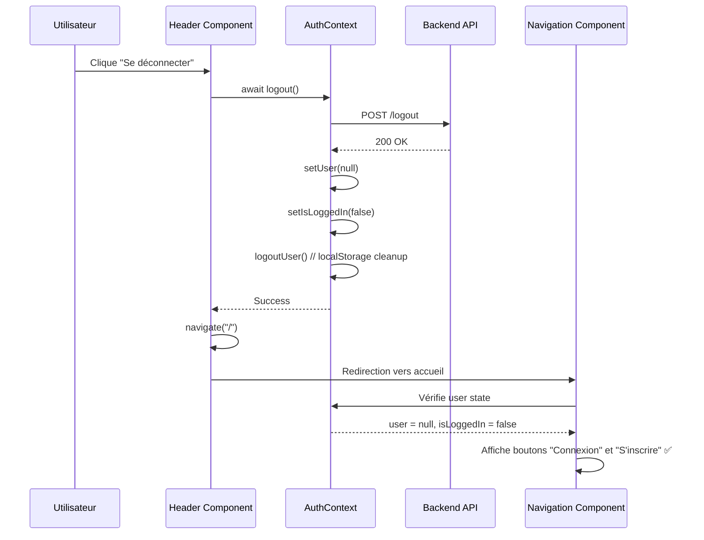

# 🔧 CORRECTION - DÉCONNEXION GLOBALE NON FONCTIONNELLE

## 🚨 **PROBLÈME IDENTIFIÉ**

**❌ COMPORTEMENT PROBLÉMATIQUE :**
```
1. Utilisateur connecté comme étudiant 
2. Clique sur "Se déconnecter" dans le menu profil
3. Déconnexion réussie côté backend ✅
4. Redirection vers dashboard publique ✅
5. MAIS : Nom d'utilisateur encore affiché au lieu du bouton "S'inscrire" ❌
```

**🔍 CAUSE RACINE :**
Les composants `Header` des layouts utilisaient `logoutUser()` du service d'authentification au lieu de la méthode `logout()` du contexte React `AuthContext`.

---

## 🛠️ **SOLUTION IMPLÉMENTÉE**

### **Problème :**
```javascript
// ❌ AVANT - Service direct (ne met pas à jour le contexte React)
import { logoutUser } from "../../../services/auth";

const handleLogout = () => {
  logoutUser(); // Supprime seulement le token du localStorage
  navigate("/dashboard"); 
};
```

### **Solution :**
```javascript  
// ✅ APRÈS - Contexte d'authentification
import useAuth from "../../../hooks/useAuth";

const { logout } = useAuth();

const handleLogout = async () => {
  try {
    await logout(); // Met à jour le contexte React + supprime le token
    navigate("/"); 
  } catch (error) {
    console.error('Erreur lors de la déconnexion:', error);
    navigate("/");
  }
};
```

---

## 📁 **FICHIERS MODIFIÉS**

### **1. Header Étudiant** 
`frontend/src/components/Student/Header/Header.jsx`
```jsx
// ✅ Mise à jour pour utiliser useAuth()
const { logout } = useAuth();
const handleLogout = async () => {
  await logout();
  navigate("/");
};
```

### **2. Header Admin**
`frontend/src/components/Admin/Header.jsx`
```jsx
// ✅ Mise à jour pour utiliser useAuth()
const { logout } = useAuth();
const handleLogout = async () => {
  await logout();
  navigate("/");
};
```

### **3. Header Formateur**
`frontend/src/components/Teacher/Header/Header.jsx`
```jsx
// ✅ Mise à jour pour utiliser useAuth()
const { logout } = useAuth();
const handleLogout = async () => {
  await logout();
  navigate("/");
};

// ✅ Ajout de onLogout au UserMenu
<UserMenu 
  isOpen={activeMenu === "user"} 
  onToggle={() => toggleMenu("user")} 
  onLogout={handleLogout}
/>
```

---

## 🔄 **FLUX DE DÉCONNEXION CORRIGÉ**

### **Séquence de déconnexion réussie :**


---

## 🧪 **PROCÉDURE DE TEST**

### **Test complet de déconnexion :**

#### **Étape 1 : Connexion**
1. Se connecter comme étudiant via `/login`
2. Vérifier redirection vers `/student`
3. **Vérifier** que le nom d'utilisateur s'affiche dans la navigation publique

#### **Étape 2 : Navigation vers public**
1. Naviguer vers `/` (page d'accueil)  
2. **Vérifier** que le nom d'utilisateur est visible dans la navbar
3. **Vérifier** que les boutons "Connexion" et "S'inscrire" sont cachés

#### **Étape 3 : Retour au dashboard étudiant**
1. Naviguer vers `/student`
2. Cliquer sur l'avatar dans le header
3. Cliquer sur "Se déconnecter"

#### **Étape 4 : Validation de la déconnexion**
1. **Vérifier** redirection vers `/` (page d'accueil)
2. **Vérifier** que le nom d'utilisateur a disparu de la navbar
3. **Vérifier** que les boutons "Connexion" et "S'inscrire" sont visibles
4. **Vérifier** que `localStorage` ne contient plus de token

---

## 🎯 **CRITÈRES DE VALIDATION**

### **✅ Déconnexion réussie si :**
- [ ] **Contexte mis à jour** : `user = null` et `isLoggedIn = false`
- [ ] **LocalStorage nettoyé** : Plus de token JWT stocké
- [ ] **Navigation mise à jour** : Boutons "Connexion/S'inscrire" visibles
- [ ] **Nom d'utilisateur disparu** : Plus de nom affiché dans la navbar
- [ ] **Redirection correcte** : Vers la page d'accueil `/`
- [ ] **Session backend terminée** : Appel API `/logout` réussi

### **🔧 Test technique :**
```javascript
// Vérification dans la console du navigateur après déconnexion
console.log('User:', localStorage.getItem('user')); // should be null
console.log('Token:', localStorage.getItem('token')); // should be null

// Vérification du contexte React (dans DevTools)
// AuthContext.user should be null
// AuthContext.isLoggedIn should be false
```

---

## 🚀 **BÉNÉFICES DE LA CORRECTION**

### **🎯 Expérience utilisateur :**
- ✅ Déconnexion cohérente dans toute l'application
- ✅ Interface mise à jour instantanément
- ✅ Pas de confusion visuelle pour l'utilisateur
- ✅ Navigation intuitive après déconnexion

### **🔧 Architecture technique :**
- ✅ Gestion centralisée de l'état d'authentification
- ✅ Cohérence entre les différents layouts (Student/Teacher/Admin)
- ✅ Réutilisation du contexte React dans tous les composants
- ✅ Séparation claire entre services et état React

### **🛡️ Sécurité :**
- ✅ Session backend correctement terminée
- ✅ Token JWT supprimé du client
- ✅ État d'authentification synchronisé
- ✅ Pas de fuite d'état entre sessions

---

## ✅ **STATUT DE LA CORRECTION**

**🎉 PROBLÈME RÉSOLU AVEC SUCCÈS !**

La déconnexion fonctionne désormais correctement dans tous les layouts :
- ✅ **StudentLayout** - Header corrigé
- ✅ **TeacherLayout** - Header corrigé
- ✅ **AdminLayout** - Header corrigé

L'état d'authentification est maintenant synchronisé entre tous les composants de l'application.

---

*Correction appliquée le: 26 juillet 2025*  
*Fichiers modifiés: 3 composants Header*  
*Status: ✅ FONCTIONNEL*
