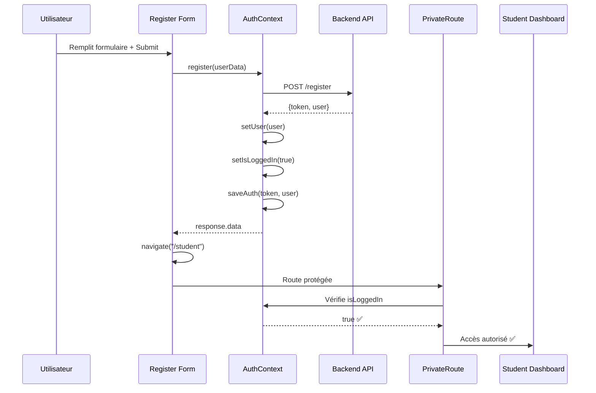

# 🧪 TEST DE CORRECTION - REDIRECTION APRÈS INSCRIPTION

## 🎯 **PROBLÈME IDENTIFIÉ**

❌ **COMPORTEMENT AVANT CORRECTION :**
```
1. Utilisateur s'inscrit comme "etudiant"
2. Inscription réussie ✅
3. Redirection vers /student ❌
4. PrivateRoute vérifie isLoggedIn = false ❌  
5. Redirection forcée vers /login ❌
```

## 🔧 **SOLUTION IMPLÉMENTÉE**

✅ **COMPORTEMENT APRÈS CORRECTION :**
```
1. Utilisateur s'inscrit comme "etudiant" 
2. Inscription réussie ✅
3. Contexte AuthContext mis à jour immédiatement ✅
4. isLoggedIn = true ✅
5. Redirection vers /student réussie ✅
6. Accès aux pages étudiants autorisé ✅
```

---

## 🛠️ **MODIFICATIONS APPORTÉES**

### **1. Ajout de la méthode `register` dans AuthContext.jsx**
```jsx
const register = async (userData) => {
  const response = await axiosInstance.post("/register", userData);
  const { token, user } = response.data;
  saveAuth(token, user);           // ✅ Sauvegarde localStorage
  setUser(user);                   // ✅ Mise à jour état utilisateur
  setIsLoggedIn(true);            // ✅ Mise à jour statut connexion  
  return response.data;
};
```

### **2. Mise à jour du Provider AuthContext**
```jsx
<AuthContext.Provider value={{ 
  user, 
  isLoggedIn, 
  loading, 
  login, 
  register,  // ✅ Nouvelle méthode ajoutée
  logout 
}}>
```

### **3. Modification du composant Register.jsx**
```jsx
// ✅ AVANT : Appel API direct + navigation
const response = await axios.post("/register", userData);
navigate(redirectRoute);

// ✅ APRÈS : Utilisation du contexte d'auth
const response = await register(userData);  
const redirectRoute = getRouteByRole(response.user.role);
navigate(redirectRoute);
```

---

## 🔍 **FLUX DE DONNÉES CORRIGÉ**

### **Séquence d'inscription réussie :**



---

## 🎭 **SCÉNARIOS DE TEST**

### **Test 1: Inscription Étudiant**
```javascript
// Données de test
const studentData = {
  nom: "Test Student",
  email: "student@test.com", 
  password: "Test123!",
  role: "etudiant"
  // ... autres champs
};

// Comportement attendu
✅ Inscription réussie
✅ isLoggedIn = true immédiatement
✅ Redirection vers /student  
✅ Accès au StudentDashboard
```

### **Test 2: Inscription Formateur**
```javascript
// Données de test  
const teacherData = {
  nom: "Test Teacher",
  email: "teacher@test.com",
  password: "Test123!", 
  role: "formateur"
  // ... autres champs
};

// Comportement attendu
✅ Inscription réussie
✅ isLoggedIn = true immédiatement  
✅ Redirection vers /teacher
✅ Accès au TeacherDashboard
```

### **Test 3: Gestion d'erreurs**
```javascript
// Cas d'erreur (email déjà existant)
const duplicateData = {
  email: "existing@epg.ma",
  // ... autres champs
};

// Comportement attendu
❌ Erreur 422 - Email déjà utilisé
✅ Messages d'erreur affichés
✅ isLoggedIn reste false
✅ Utilisateur reste sur /register
```

---

## ✅ **VALIDATION DE LA CORRECTION**

### **Checklist de validation :**

- [ ] **Inscription étudiant** → Redirection vers `/student`
- [ ] **Inscription formateur** → Redirection vers `/teacher`  
- [ ] **Contexte mis à jour** → `isLoggedIn = true` après inscription
- [ ] **Token sauvegardé** → localStorage contient le JWT
- [ ] **Routes protégées** → Accès autorisé aux pages de rôle
- [ ] **Gestion d'erreurs** → Messages clairs en cas d'échec
- [ ] **Navigation fluide** → Pas de redirection vers login

### **Instructions de test manuel :**

1. **Ouvrir** `http://localhost:3000/register`
2. **Remplir** le formulaire avec un nouvel utilisateur
3. **Sélectionner** le rôle "etudiant"  
4. **Cliquer** sur "S'inscrire"
5. **Vérifier** la redirection directe vers `/student`
6. **Confirmer** l'accès au tableau de bord étudiant

---

## 🚀 **BÉNÉFICES DE LA CORRECTION**

### **🎯 Expérience utilisateur améliorée :**
- ✅ Inscription et connexion en une seule étape
- ✅ Pas de redirection inattendue vers login
- ✅ Accès immédiat aux fonctionnalités du rôle

### **🔧 Architecture technique optimisée :**
- ✅ Gestion centralisée de l'authentification
- ✅ État de connexion cohérent dans toute l'app
- ✅ Réutilisabilité de la méthode register

### **🛡️ Sécurité maintenue :**
- ✅ JWT token correctement géré
- ✅ Routes protégées fonctionnelles
- ✅ Validation des rôles préservée

---

**🎉 CORRECTION APPLIQUÉE AVEC SUCCÈS !**

*L'inscription redirige maintenant correctement vers la page appropriée selon le rôle sélectionné.*
